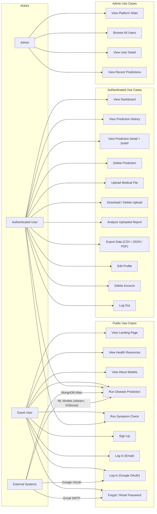
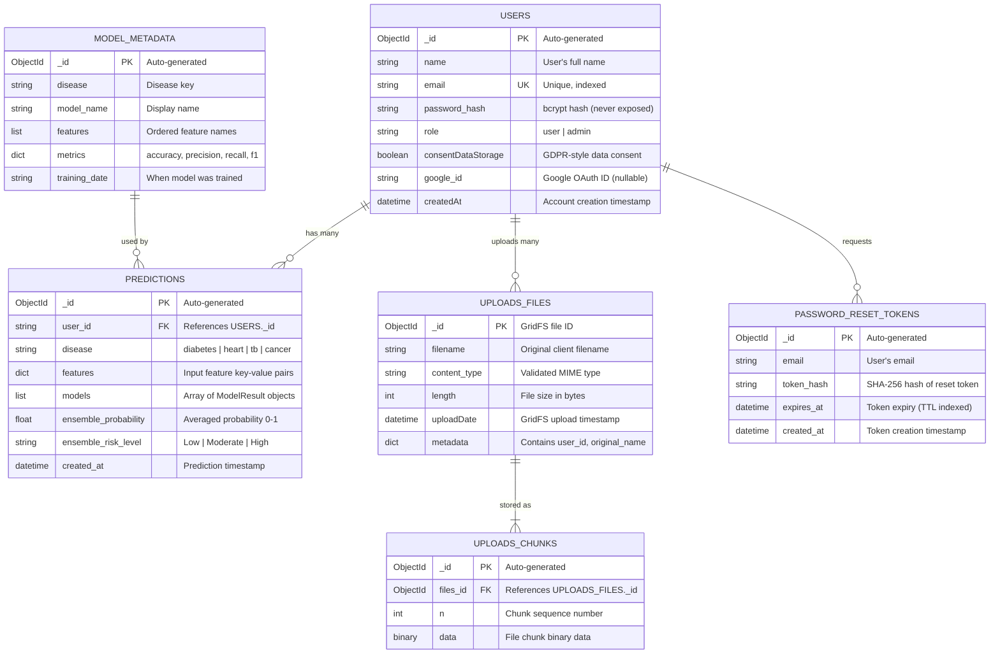
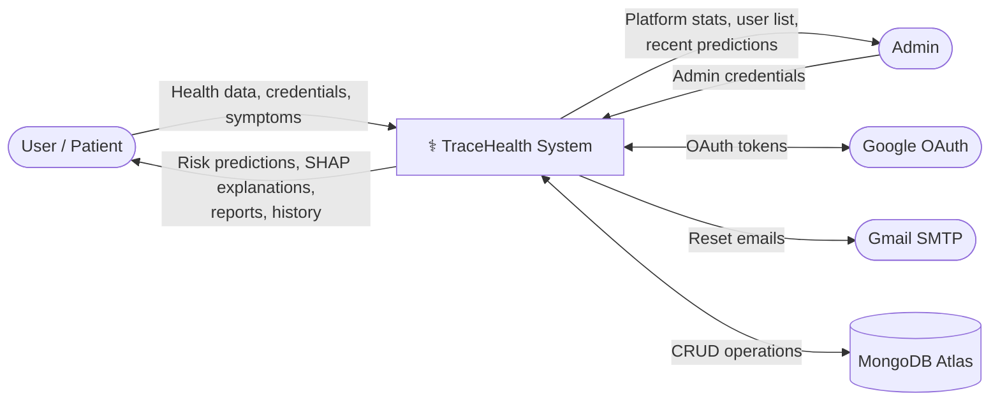
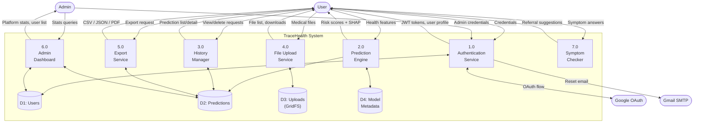
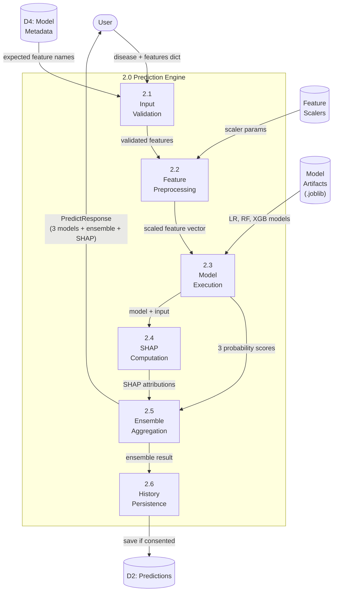
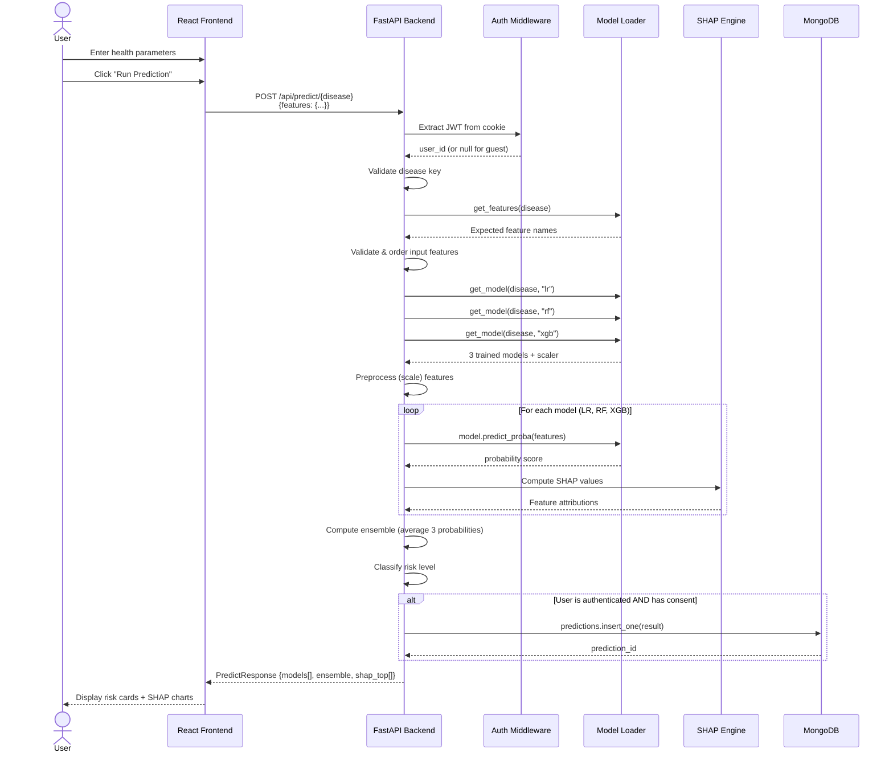
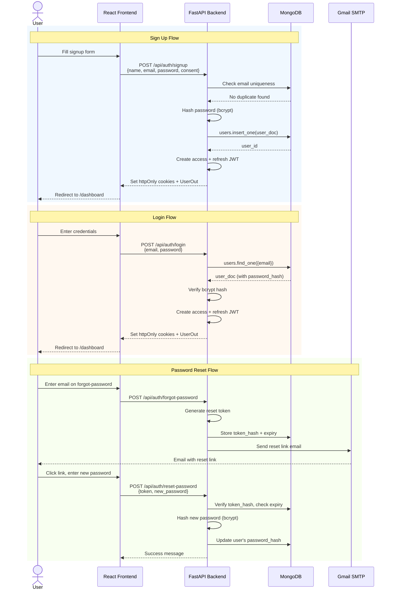
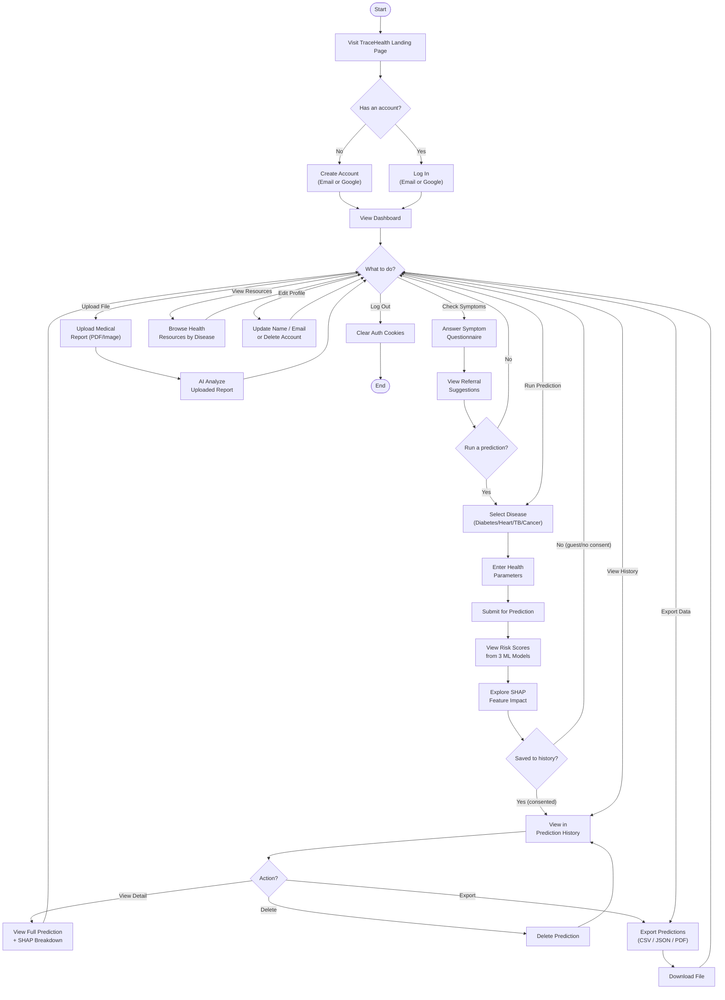

# TraceHealth — Software Engineering Diagrams

All diagrams for the TraceHealth Explainable AI Health Screening platform, rendered using Mermaid.

---

## 1. Use Case Diagram

---

## 2. Entity Relationship Diagram (ERD)

---

## 3. UML Class Diagram

```mermaid
classDiagram
    class FastAPIApp {
        +lifespan(app)
        +CORSMiddleware
        +SecurityHeadersMiddleware
        +RateLimiter
    }

    class Settings {
        +str MONGO_URI
        +str JWT_SECRET
        +str FRONTEND_ORIGIN
        +str ENVIRONMENT
        +str MODELS_DIR
        +allowed_origins() list
        +is_production() bool
        +cookie_secure() bool
    }

    class Database {
        +init_db()
        +close_db()
        +get_db() AsyncIOMotorDatabase
        +get_gridfs() GridFSBucket
        -_create_indexes()
        -_seed_model_metadata()
    }

    class AuthRouter {
        +signup(SignupRequest) TokenResponse
        +login(LoginRequest) TokenResponse
        +logout() Message
        +me() UserOut
        +refresh() TokenResponse
        +forgot_password(ForgotPasswordRequest) Message
        +reset_password(ResetPasswordRequest) Message
        +google_redirect() RedirectResponse
        +google_callback() RedirectResponse
        +admin_login(LoginRequest) TokenResponse
        +admin_setup() Message
    }

    class PredictRouter {
        +predict(disease, PredictRequest) PredictResponse
        +get_features(disease) FeaturesResponse
    }

    class HistoryRouter {
        +list_history(skip, limit, disease) HistoryList
        +get_history_detail(id) PredictionDoc
        +delete_history(id) Message
    }

    class UploadsRouter {
        +upload_file(file) UploadItem
        +list_uploads(skip, limit) UploadListResponse
        +download_file(file_id) StreamingResponse
        +delete_file(file_id) Message
    }

    class ExportRouter {
        +export_predictions(format, date_range) File
        +export_pdf(date_range, disease) PDF
        +export_single(id, format) File
    }

    class AdminRouter {
        +get_stats() StatsResponse
        +list_users(skip, limit) UserList
        +get_user(user_id) UserDetail
        +recent_predictions(limit) PredictionList
    }

    class SymptomCheckRouter {
        +check_symptoms(SymptomCheckRequest) SymptomCheckResponse
    }

    class ModelLoader {
        +DISEASES: list
        +load_all_models()
        +get_model(disease, model_key) Model
        +get_scaler(disease) Scaler
        +get_features(disease) list
        +is_loaded() bool
    }

    class ModelComparison {
        +compare_models(disease, features) list~ModelResult~
        -_run_single_model(model, scaler, features) ModelResult
        -_compute_shap(model, scaler, features) list~ShapFeature~
    }

    class JWTCore {
        +create_access_token(user_id, role) str
        +create_refresh_token(user_id) str
        +verify_refresh_token(token) dict
        +create_reset_token(email) str
        +verify_reset_token(token) str
    }

    class SecurityDependencies {
        +require_auth(request) dict
        +require_admin(request) dict
        +get_current_user(request) dict|None
        +user_has_consented(user) bool
    }

    FastAPIApp --> Settings
    FastAPIApp --> Database
    FastAPIApp --> AuthRouter
    FastAPIApp --> PredictRouter
    FastAPIApp --> HistoryRouter
    FastAPIApp --> UploadsRouter
    FastAPIApp --> ExportRouter
    FastAPIApp --> AdminRouter
    FastAPIApp --> SymptomCheckRouter
    PredictRouter --> ModelLoader
    PredictRouter --> ModelComparison
    AuthRouter --> JWTCore
    AuthRouter --> SecurityDependencies
    HistoryRouter --> SecurityDependencies
    UploadsRouter --> SecurityDependencies
    ExportRouter --> SecurityDependencies
    AdminRouter --> SecurityDependencies
```

---

## 4. Data Flow Diagram — Level 0 (Context)

---

## 5. Data Flow Diagram — Level 1 (Subsystems)

---

## 6. Data Flow Diagram — Level 2 (Prediction Subsystem Detail)

---

## 7. Data Dictionary

### 7.1 `users` Collection

| Field | Type | Constraints | Description |
|-------|------|------------|-------------|
| `_id` | ObjectId | PK, auto-generated | Unique user identifier |
| `name` | String | Required, 2–80 chars | User's full display name |
| `email` | String | Required, unique index | Email address (login credential) |
| `password_hash` | String | Required (null for Google OAuth users) | bcrypt-hashed password (never exposed in API responses) |
| `role` | String | Enum: `"user"`, `"admin"` | Authorization role. Default: `"user"` |
| `consentDataStorage` | Boolean | Required | Whether user consents to storing prediction history |
| `google_id` | String | Nullable, unique if present | Google account ID for OAuth-linked accounts |
| `createdAt` | DateTime | Auto-set on creation | Account registration timestamp (UTC) |

**Indexes:**
- `email` — unique index (prevents duplicate accounts)

---

### 7.2 `predictions` Collection

| Field | Type | Constraints | Description |
|-------|------|------------|-------------|
| `_id` | ObjectId | PK, auto-generated | Unique prediction identifier |
| `user_id` | String | FK → `users._id`, indexed | The user who ran this prediction |
| `disease` | String | Enum: `"diabetes"`, `"heart"`, `"tb"`, `"cancer"` | Disease model used |
| `features` | Object | Required | Input feature key-value pairs (e.g., `{"Glucose": 148, "BMI": 33.6}`) |
| `models` | Array[Object] | Required, exactly 3 items | Results from each ML model (see sub-table below) |
| `ensemble_probability` | Float | Range: 0.0–1.0 | Average probability across all 3 models |
| `ensemble_risk_level` | String | Enum: `"Low"`, `"Moderate"`, `"High"` | Risk classification based on ensemble probability |
| `created_at` | DateTime | Auto-set on creation | Prediction execution timestamp (UTC) |

**Nested: `models[]` sub-document**

| Field | Type | Description |
|-------|------|-------------|
| `model_key` | String | Identifier: `"lr"`, `"rf"`, `"xgb"` |
| `model_name` | String | Display name: `"Logistic Regression"`, `"Random Forest"`, `"XGBoost"` |
| `probability` | Float | Positive-class probability from this model (0.0–1.0) |
| `risk_level` | String | Risk category for this individual model |
| `shap_top` | Array[Object] | Top SHAP feature attributions, sorted by abs value descending |

**Nested: `shap_top[]` sub-document**

| Field | Type | Description |
|-------|------|-------------|
| `feature` | String | Feature name (e.g., `"Glucose"`) |
| `value` | Float | Raw input value (unscaled) |
| `shap_value` | Float | SHAP contribution to prediction |
| `direction` | String | `"increases_risk"` or `"decreases_risk"` |

**Indexes:**
- `(user_id, created_at)` — compound index for fast per-user history queries

---

### 7.3 `uploads.files` Collection (GridFS)

| Field | Type | Constraints | Description |
|-------|------|------------|-------------|
| `_id` | ObjectId | PK, auto-generated | GridFS file identifier |
| `filename` | String | Required | Sanitized original filename |
| `length` | Integer | Auto-set by GridFS | File size in bytes |
| `chunkSize` | Integer | Default: 261120 | GridFS chunk size |
| `uploadDate` | DateTime | Auto-set by GridFS | Upload timestamp |
| `contentType` | String | Validated: PDF, PNG, JPEG, CSV | MIME type verified from magic bytes (not client-supplied) |
| `metadata.user_id` | String | FK → `users._id` | Uploading user's ID |
| `metadata.original_name` | String | — | Client-provided filename (for display only) |

**Indexes:**
- `metadata.user_id` — for listing a user's uploads

### 7.4 `uploads.chunks` Collection (GridFS)

| Field | Type | Constraints | Description |
|-------|------|------------|-------------|
| `_id` | ObjectId | PK, auto-generated | Chunk identifier |
| `files_id` | ObjectId | FK → `uploads.files._id` | Parent file reference |
| `n` | Integer | Sequence number, 0-indexed | Chunk order within the file |
| `data` | Binary | Max 261120 bytes per chunk | Raw file binary data |

---

### 7.5 `model_metadata` Collection

| Field | Type | Constraints | Description |
|-------|------|------------|-------------|
| `_id` | ObjectId | PK, auto-generated | Metadata document ID |
| `disease` | String | Enum: `"diabetes"`, `"heart"`, `"tb"`, `"cancer"` | Which disease this metadata describes |
| `display_name` | String | — | Human-readable disease name |
| `features` | Array[String] | Ordered | Expected input feature names for this disease model |
| `models` | Object | 3 keys: `lr`, `rf`, `xgb` | Per-model evaluation metrics |
| `models.*.accuracy` | Float | 0.0–1.0 | Test set accuracy |
| `models.*.precision` | Float | 0.0–1.0 | Test set precision |
| `models.*.recall` | Float | 0.0–1.0 | Test set recall |
| `models.*.f1` | Float | 0.0–1.0 | Test set F1 score |
| `training_samples` | Integer | — | Number of training samples used |
| `test_samples` | Integer | — | Number of test samples used |

---

## 8. Sequence Diagram — Disease Prediction Flow

---

## 9. Sequence Diagram — Authentication Flow

---

## 10. Activity Diagram — End-to-End User Workflow

---

> [!NOTE]
> All diagrams use **Mermaid** syntax and render directly in GitHub, VS Code, Notion, and any Markdown renderer that supports Mermaid. To export as PNG/SVG, use [mermaid.live](https://mermaid.live) or the VS Code Mermaid preview extension.
